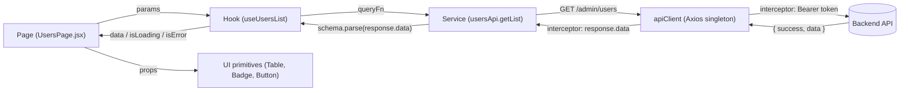
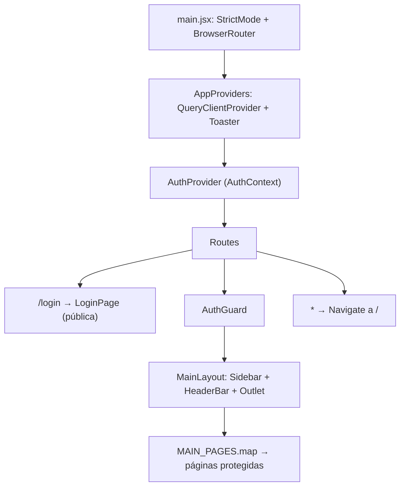

# Guía de Réplica de Arquitectura Frontend
### Basada en `c:\projects\BackOffice` (Bitobbu BackOffice) → Nuevo proyecto para cliente

> **Propósito:** documentar con precisión *cómo* está construido el BackOffice (arquitectura, orden de carpetas, librerías de CSS/diseño, componentes reutilizables y convenciones), para emularlo en el nuevo proyecto, incorporando una **paleta de colores nueva y amigable** y corrigiendo las deudas técnicas detectadas en el original.

---

## Índice

1. [Resumen ejecutivo](#1-resumen-ejecutivo)
2. [Stack tecnológico](#2-stack-tecnológico)
3. [Cómo fue lograda la arquitectura](#3-cómo-fue-lograda-la-arquitectura)
4. [Estructura de carpetas](#4-estructura-de-carpetas)
5. [Convenciones de nombres](#5-convenciones-de-nombres)
6. [Archivos de configuración base](#6-archivos-de-configuración-base)
7. [Capa de infraestructura (core de la app)](#7-capa-de-infraestructura-core-de-la-app)
8. [Componentes reutilizables](#8-componentes-reutilizables)
9. [Receta: cómo crear un feature completo](#9-receta-cómo-crear-un-feature-completo)
10. [Patrones de UI/UX obligatorios](#10-patrones-de-uiux-obligatorios)
11. [Paleta de colores nueva (Design Tokens)](#11-paleta-de-colores-nueva-design-tokens)
12. [Tipografía, iconografía, espaciado y radios](#12-tipografía-iconografía-espaciado-y-radios)
13. [Instalación paso a paso en el nuevo proyecto](#13-instalación-paso-a-paso-en-el-nuevo-proyecto)
14. [Deudas técnicas del original que NO debemos copiar](#14-deudas-técnicas-del-original-que-no-debemos-copiar)
15. [Anti‑patrones y Definition of Done](#15-antipatrones-y-definition-of-done)
16. [Contrato esperado con el Backend](#16-contrato-esperado-con-el-backend)

---

## 1. Resumen ejecutivo

El BackOffice es una **SPA administrativa en React 18 + Vite**, estilizada con **Tailwind CSS 3 + shadcn/ui (estilo `new-york`) sobre primitivas Radix UI**, con estado de servidor manejado por **TanStack React Query 5**, HTTP vía **un único cliente Axios**, validación de respuestas con **Zod**, notificaciones con **Sonner** e iconos de **lucide-react**.

La arquitectura es **Feature‑First (por dominio)** con una separación estricta en 4 capas dentro de cada feature:

```
schema (Zod)  →  service (Axios)  →  hook (React Query)  →  page / components (UI)
```

Puntos clave que la hacen robusta y fácil de replicar:

| Pilar | Cómo se logra |
|---|---|
| **Escalabilidad** | Cada dominio vive aislado en `src/features/<dominio>/`. Agregar un módulo no toca a los demás. |
| **Consistencia visual** | Todos los colores son **tokens semánticos** (CSS variables HSL) consumidos por Tailwind; nada de colores "hardcodeados". |
| **Reutilización** | Componentes UI primitivos en `src/components/ui/` (copiados de shadcn, editables), con variantes vía `class-variance-authority`. |
| **Seguridad** | `AuthGuard` + interceptores Axios (inyección de JWT y manejo global de `401`). |
| **Rutas centralizadas** | Un solo registro de páginas (`pages.config.js`) que alimenta Router y Sidebar. |
| **Contratos tipados en runtime** | Cada respuesta del backend se valida con `schema.parse()` antes de llegar a la UI. |
| **Reglas escritas** | Carpeta `.rules/` con arquitectura, guía de nuevo feature y anti‑patrones. |

---

## 2. Stack tecnológico

### 2.1 Librerías **realmente usadas** por el código (verificado analizando los imports de `src/`)

| Categoría | Librería | Versión en BackOffice | Uso |
|---|---|---|---|
| Core | `react`, `react-dom` | ^18.2.0 | UI |
| Build | `vite` + `@vitejs/plugin-react` | ^6.1.0 / ^4.3.4 | Dev server y bundling |
| Routing | `react-router-dom` | ^6.26.0 | Rutas, `NavLink`, `Outlet`, `Navigate` |
| Server state | `@tanstack/react-query` | ^5.84.1 | `useQuery`, `useMutation`, caché e invalidación |
| HTTP | `axios` | ^1.13.6 | Cliente único con interceptores |
| Validación | `zod` | ^3.24.2 | Validación de respuestas del API |
| Toasts | `sonner` | ^2.0.1 | Feedback éxito/error |
| Iconos | `lucide-react` | ^0.475.0 | Iconografía |
| **CSS** | `tailwindcss` | ^3.4.17 | Utilidades CSS |
| **CSS** | `postcss` + `autoprefixer` | ^8.5.3 / ^10.4.20 | Pipeline CSS |
| **CSS** | `tailwindcss-animate` | ^1.0.7 | Animaciones `animate-in/out` de Radix/shadcn |
| **Diseño** | `class-variance-authority` (cva) | ^0.7.1 | Variantes de componentes (`variant`, `size`) |
| **Diseño** | `clsx` + `tailwind-merge` | ^2.1.1 / ^3.0.2 | Helper `cn()` para combinar clases sin conflictos |
| **Diseño** | `@radix-ui/react-slot` | ^1.1.2 | Patrón `asChild` del Button |
| **Diseño** | `@radix-ui/react-dialog` | ^1.1.6 | `Dialog` |
| **Diseño** | `@radix-ui/react-alert-dialog` | ^1.1.6 | `AlertDialog` (confirmaciones) |
| **Diseño** | `@radix-ui/react-dropdown-menu` | ^2.1.6 | Menú de acciones por fila |
| **Diseño** | `@radix-ui/react-select` | ^2.1.6 | `Select` |
| **Diseño** | `@radix-ui/react-label` | ^2.1.2 | `Label` accesible |

### 2.2 Librerías instaladas pero **no usadas** en el original

El `package.json` del BackOffice trae ~40 dependencias heredadas de una plantilla (todas las `@radix-ui/*` restantes, `framer-motion`, `three`, `recharts`, `react-leaflet`, `react-quill`, `jspdf`, `html2canvas`, `moment`, `react-hot-toast`, `@stripe/*`, `socket.io-client`, `embla-carousel-react`, `vaul`, `cmdk`, `input-otp`, `react-day-picker`, `react-resizable-panels`, `next-themes`, `lodash`, `canvas-confetti`, `react-markdown`, `@hello-pangea/dnd`, `@hookform/resolvers`, `react-hook-form`...).

> [!IMPORTANT]
> **En el nuevo proyecto NO instalaremos dependencias "por si acaso".** Cada librería se agrega cuando un feature la necesite. Las opcionales recomendadas están en la sección 13.3.

### 2.3 Tooling

| Herramienta | Detalle |
|---|---|
| ESLint 9 (flat config) | `@eslint/js`, `eslint-plugin-react`, `react-hooks`, `react-refresh`, `unused-imports` |
| TypeScript (solo typecheck) | `tsc -p ./jsconfig.json` sobre JS (`strict: false`) |
| Alias | `@/` → `src/` (configurado en Vite y `jsconfig.json`) |
| Deploy | Vercel con rewrite SPA (`vercel.json`) |

---

## 3. Cómo fue lograda la arquitectura

### 3.1 Principio rector: *Feature‑First + capas finas*

Cada dominio de negocio (usuarios, verificaciones, suscripciones, etc.) es una carpeta autocontenida. Dentro, las responsabilidades se reparten así:

| Capa | Archivo | Responsabilidad | Prohibido |
|---|---|---|---|
| **Schema** | `schemas/<feature>.schema.js` | Define con Zod la forma exacta de la respuesta del backend. | Lógica, llamadas HTTP |
| **Service** | `services/<feature>Api.js` | Un método por endpoint. Usa solo `apiClient`. Hace `schema.parse()`. | Hooks, estado, toasts, UI |
| **Hook** | `hooks/use<Feature>Data.js` | Orquesta `useQuery`/`useMutation`, query keys, invalidaciones y toasts. | JSX, axios directo |
| **Page** | `<Feature>Page.jsx` | Orquesta layout y estado local de UI (filtros, paginación, modales abiertos). | Axios, `useQuery` directo, lógica pesada |
| **Components** | `components/*.jsx` | Piezas visuales del feature (dialogs de detalle, etc.). Reciben datos por props o usan hooks del feature. | Llamar services directamente |

### 3.2 Flujo de datos



### 3.3 Árbol de providers y rutas



### 3.4 Autenticación (cómo funciona de punta a punta)

1. **Login** → `AuthContext.login()` llama `authApi.login()` → guarda `token` + `admin` en `localStorage` (`lib/authStorage.js`).
2. **Cada request** → interceptor de Axios agrega `Authorization: Bearer <token>`.
3. **Refresh de página** → `AuthProvider` lee la sesión guardada y la revalida con `GET /admin/auth/me`. Mientras tanto `isLoadingSession = true` y `AuthGuard` muestra "Verificando sesión...".
4. **401 en cualquier request** → interceptor limpia sesión y redirige a `/login`.
5. **Logout** → limpia storage y redirige a `/login`.

### 3.5 Routing centralizado

`src/pages.config.js` exporta `MAIN_PAGES`: un array de objetos `{ path, name, component, showInSidebar, sidebarGroup }`. Ese **único registro** alimenta:
- `App.jsx` → genera las `<Route>` hijas de `MainLayout`.
- `Sidebar.jsx` → genera los links de navegación (filtrando `showInSidebar`).

### 3.6 Patrón "Registry‑Driven UI" (muy reutilizable)

El módulo `lookups` demuestra un patrón potente: **una sola página genérica** (`LookupsPage.jsx`) renderiza N tablas maestras distintas a partir de un **registro declarativo** (`lookupsTableRegistry.js`):

```js
{
  key: 'units_of_measure',
  label: 'Unidades de Medida',
  description: 'Opciones como Kg, Litros, Cajas, etc.',
  endpoint: '/admin/lookups/units_of_measure',
  supportsCreate: true,
  supportsEdit: true,
  supportsStatus: true,
  columns: [
    { key: 'code', label: 'Abreviatura' },
    { key: 'label', label: 'Nombre' },
    { key: 'is_active', label: 'Status', type: 'status' },
  ],
}
```

La página lee `:tableKey` de la URL, busca la configuración, y construye columnas, botones (crear/editar/activar) y el formulario según los flags. **Agregar una tabla maestra nueva = agregar un objeto al registro.** Ideal para catálogos del cliente (productos, unidades, almacenes, sucursales, etc.).

---

## 4. Estructura de carpetas

### 4.1 Estructura real del BackOffice

```txt
BackOffice/
├── .rules/                         # Reglas de arquitectura escritas (para humanos y agentes IA)
│   ├── 00-architecture.md
│   ├── 01-new-feature-guide.md
│   └── 02-anti-patterns.md
├── index.html
├── components.json                 # Config de shadcn/ui
├── tailwind.config.js
├── postcss.config.js
├── vite.config.js
├── jsconfig.json                   # Alias @/ + typecheck
├── eslint.config.js
├── vercel.json                     # Rewrite SPA
└── src/
    ├── main.jsx                    # Bootstrap: StrictMode + BrowserRouter
    ├── App.jsx                     # Providers + árbol de rutas
    ├── index.css                   # Tailwind layers + design tokens (CSS vars)
    ├── pages.config.js             # Registro central de páginas
    ├── api/
    │   └── axiosClient.js          # Axios singleton + interceptores
    ├── app/
    │   ├── providers/AppProviders.jsx   # QueryClient + Toaster
    │   └── router/AuthGuard.jsx         # Protección de rutas
    ├── components/
    │   ├── DataTableFilters.jsx    # Componente compuesto reutilizable (filtros de tabla)
    │   └── ui/                     # Primitivas shadcn (editables)
    │       ├── alert-dialog.jsx
    │       ├── badge.jsx
    │       ├── button.jsx
    │       ├── card.jsx
    │       ├── dialog.jsx
    │       ├── dropdown-menu.jsx
    │       ├── input.jsx
    │       ├── label.jsx
    │       ├── select.jsx
    │       ├── table.jsx
    │       └── textarea.jsx
    ├── features/                   # UN FOLDER POR DOMINIO
    │   ├── auth/
    │   │   ├── AuthContext.jsx
    │   │   ├── LoginPage.jsx
    │   │   ├── schemas/auth.schema.js
    │   │   └── services/authApi.js
    │   ├── dashboard/
    │   │   ├── DashboardPage.jsx
    │   │   ├── hooks/useDashboardData.js
    │   │   ├── schemas/dashboard.schema.js
    │   │   └── services/dashboardApi.js
    │   ├── users/
    │   │   ├── UsersPage.jsx
    │   │   ├── components/UserDetailDialog.jsx
    │   │   ├── hooks/useUsersData.js
    │   │   ├── schemas/users.schema.js
    │   │   └── services/usersApi.js
    │   ├── lookups/                # Patrón registry-driven
    │   │   ├── LookupsIndexPage.jsx
    │   │   ├── LookupsPage.jsx
    │   │   ├── lookupsTableRegistry.js
    │   │   ├── hooks/ schemas/ services/
    │   └── ... (admins, geography, plansCatalog, quoteResponses,
    │            rfqs, subscriptions, transactions, verifications)
    ├── hooks/                      # Hooks transversales
    │   ├── use-debounce.js
    │   └── useDownloadFile.js
    ├── layouts/
    │   └── MainLayout/
    │       ├── MainLayout.jsx
    │       ├── Sidebar.jsx
    │       └── HeaderBar.jsx
    └── lib/
        ├── authStorage.js          # Persistencia de sesión
        ├── queryClient.js          # Config global React Query
        └── utils.js                # cn()
```

### 4.2 Estructura propuesta para el nuevo proyecto (mejorada)

Mantiene 1:1 la filosofía, añadiendo carpetas para componentes compartidos de alto nivel y configuración:

```txt
src/
├── main.jsx
├── App.jsx
├── index.css
├── pages.config.js                 # + icon + lazy() por página
├── api/
│   └── axiosClient.js
├── app/
│   ├── providers/AppProviders.jsx
│   └── router/
│       ├── AuthGuard.jsx
│       └── RoleGuard.jsx           # (nuevo) permisos por rol si el cliente lo requiere
├── components/
│   ├── ui/                         # Primitivas shadcn (button, card, dialog, ...)
│   └── shared/                     # (nuevo) Compuestos reutilizables de la app
│       ├── PageHeader.jsx
│       ├── DataTable.jsx           # Tabla con loading/empty/error integrados
│       ├── DataTableFilters.jsx
│       ├── Pagination.jsx
│       ├── StatusBadge.jsx
│       ├── ConfirmDialog.jsx
│       ├── KpiCard.jsx
│       └── states/
│           ├── LoadingState.jsx
│           ├── EmptyState.jsx
│           └── ErrorState.jsx
├── config/                         # (nuevo) constantes de app
│   ├── env.js                      # lectura centralizada de import.meta.env
│   └── constants.js                # PAGE_SIZE, formatos de fecha, locales
├── features/
│   └── <dominio>/
│       ├── <Dominio>Page.jsx
│       ├── components/
│       ├── hooks/use<Dominio>Data.js
│       ├── schemas/<dominio>.schema.js
│       ├── services/<dominio>Api.js
│       └── <dominio>.keys.js       # (nuevo) query keys factory
├── hooks/
│   ├── use-debounce.js
│   └── useDownloadFile.js
├── layouts/
│   └── MainLayout/
│       ├── MainLayout.jsx
│       ├── Sidebar.jsx
│       └── HeaderBar.jsx
└── lib/
    ├── authStorage.js
    ├── queryClient.js
    ├── formatters.js               # (nuevo) fechas, moneda, números
    ├── errors.js                   # (nuevo) getErrorMessage(error)
    └── utils.js
```

> [!TIP]
> Copiar también la carpeta `.rules/` adaptada al nuevo cliente. Es la "constitución" del proyecto y mantiene alineados a todos los desarrolladores (y asistentes IA).

---

## 5. Convenciones de nombres

| Elemento | Convención | Ejemplo |
|---|---|---|
| Carpeta de feature | `camelCase` | `features/purchaseOrders/` |
| Página | `PascalCase` + `Page.jsx` | `PurchaseOrdersPage.jsx` |
| Componente de feature | `PascalCase.jsx` | `OrderDetailDialog.jsx` |
| Hook de feature | `use` + `PascalCase` + `Data.js` | `usePurchaseOrdersData.js` |
| Service | `camelCase` + `Api.js`, exporta objeto | `purchaseOrdersApi.js` → `export const purchaseOrdersApi = {...}` |
| Schema | `camelCase.schema.js` | `purchaseOrders.schema.js` |
| Primitiva UI | `kebab-case.jsx` (convención shadcn) | `alert-dialog.jsx`, `dropdown-menu.jsx` |
| Hook global | `use-kebab.js` o `useCamel.js` (unificar: **recomendado `useCamel.js`**) | `useDebounce.js` |
| Query keys | `[dominio, tipo, params]` | `['users', 'list', params]`, `['users', 'detail', id]` |
| Exports | Páginas: `export default`. Hooks/services/componentes UI: **named exports** | — |
| Textos de UI | Español | "Cargando usuarios...", "Guardar" |

---

## 6. Archivos de configuración base

### 6.1 `vite.config.js`

```js
import react from '@vitejs/plugin-react';
import path from 'path';
import { defineConfig } from 'vite';

export default defineConfig({
  plugins: [react()],
  resolve: {
    alias: {
      '@': path.resolve(__dirname, './src'),
    },
  },
});
```

> [!NOTE]
> El original incluye `server.historyApiFallback: true`, que **no es una opción de Vite** (es de webpack-dev-server). Vite ya sirve `index.html` para rutas SPA por defecto. Se omite.

### 6.2 `jsconfig.json`

```json
{
  "compilerOptions": {
    "target": "ES2020",
    "lib": ["ES2020", "DOM", "DOM.Iterable"],
    "module": "ESNext",
    "moduleResolution": "bundler",
    "jsx": "react-jsx",
    "skipLibCheck": true,
    "resolveJsonModule": true,
    "isolatedModules": true,
    "noEmit": true,
    "strict": false,
    "baseUrl": ".",
    "paths": { "@/*": ["./src/*"] }
  },
  "include": ["src"]
}
```

### 6.3 `postcss.config.js`

```js
export default {
  plugins: {
    tailwindcss: {},
    autoprefixer: {},
  },
};
```

### 6.4 `components.json` (shadcn/ui)

```json
{
  "$schema": "https://ui.shadcn.com/schema.json",
  "style": "new-york",
  "rsc": false,
  "tsx": false,
  "tailwind": {
    "config": "tailwind.config.js",
    "css": "src/index.css",
    "baseColor": "slate",
    "cssVariables": true,
    "prefix": ""
  },
  "aliases": {
    "components": "@/components",
    "utils": "@/lib/utils",
    "ui": "@/components/ui",
    "lib": "@/lib",
    "hooks": "@/hooks"
  },
  "iconLibrary": "lucide"
}
```

### 6.5 `tailwind.config.js` (extendido con los tokens nuevos)

```js
import tailwindcssAnimate from 'tailwindcss-animate';
import defaultTheme from 'tailwindcss/defaultTheme';

/** @type {import('tailwindcss').Config} */
export default {
  darkMode: ['class'],
  content: ['./index.html', './src/**/*.{js,jsx,ts,tsx}'],
  theme: {
    container: { center: true, padding: '1rem', screens: { '2xl': '1400px' } },
    extend: {
      fontFamily: {
        sans: ['Inter', ...defaultTheme.fontFamily.sans],
        heading: ['"Plus Jakarta Sans"', 'Inter', ...defaultTheme.fontFamily.sans],
        mono: ['"JetBrains Mono"', ...defaultTheme.fontFamily.mono],
      },
      borderRadius: {
        xl: 'calc(var(--radius) + 4px)',
        lg: 'var(--radius)',
        md: 'calc(var(--radius) - 2px)',
        sm: 'calc(var(--radius) - 4px)',
      },
      colors: {
        background: 'hsl(var(--background))',
        foreground: 'hsl(var(--foreground))',
        card: { DEFAULT: 'hsl(var(--card))', foreground: 'hsl(var(--card-foreground))' },
        popover: { DEFAULT: 'hsl(var(--popover))', foreground: 'hsl(var(--popover-foreground))' },
        primary: { DEFAULT: 'hsl(var(--primary))', foreground: 'hsl(var(--primary-foreground))' },
        secondary: { DEFAULT: 'hsl(var(--secondary))', foreground: 'hsl(var(--secondary-foreground))' },
        muted: { DEFAULT: 'hsl(var(--muted))', foreground: 'hsl(var(--muted-foreground))' },
        accent: { DEFAULT: 'hsl(var(--accent))', foreground: 'hsl(var(--accent-foreground))' },
        brand: { DEFAULT: 'hsl(var(--brand))', foreground: 'hsl(var(--brand-foreground))' },
        destructive: { DEFAULT: 'hsl(var(--destructive))', foreground: 'hsl(var(--destructive-foreground))' },
        success: { DEFAULT: 'hsl(var(--success))', foreground: 'hsl(var(--success-foreground))' },
        warning: { DEFAULT: 'hsl(var(--warning))', foreground: 'hsl(var(--warning-foreground))' },
        info: { DEFAULT: 'hsl(var(--info))', foreground: 'hsl(var(--info-foreground))' },
        border: 'hsl(var(--border))',
        input: 'hsl(var(--input))',
        ring: 'hsl(var(--ring))',
        chart: {
          1: 'hsl(var(--chart-1))',
          2: 'hsl(var(--chart-2))',
          3: 'hsl(var(--chart-3))',
          4: 'hsl(var(--chart-4))',
          5: 'hsl(var(--chart-5))',
        },
        sidebar: {
          DEFAULT: 'hsl(var(--sidebar-background))',
          foreground: 'hsl(var(--sidebar-foreground))',
          primary: 'hsl(var(--sidebar-primary))',
          'primary-foreground': 'hsl(var(--sidebar-primary-foreground))',
          accent: 'hsl(var(--sidebar-accent))',
          'accent-foreground': 'hsl(var(--sidebar-accent-foreground))',
          border: 'hsl(var(--sidebar-border))',
          ring: 'hsl(var(--sidebar-ring))',
          muted: 'hsl(var(--sidebar-muted))',
        },
      },
      boxShadow: {
        card: '0 1px 2px 0 hsl(var(--shadow-color) / 0.06), 0 1px 3px 0 hsl(var(--shadow-color) / 0.10)',
        elevated: '0 10px 30px -10px hsl(var(--shadow-color) / 0.25)',
      },
      keyframes: {
        'accordion-down': { from: { height: '0' }, to: { height: 'var(--radix-accordion-content-height)' } },
        'accordion-up': { from: { height: 'var(--radix-accordion-content-height)' }, to: { height: '0' } },
        'fade-in-up': { from: { opacity: '0', transform: 'translateY(6px)' }, to: { opacity: '1', transform: 'translateY(0)' } },
      },
      animation: {
        'accordion-down': 'accordion-down 0.2s ease-out',
        'accordion-up': 'accordion-up 0.2s ease-out',
        'fade-in-up': 'fade-in-up 0.25s ease-out both',
      },
    },
  },
  plugins: [tailwindcssAnimate],
};
```

### 6.6 `eslint.config.js` (idéntico al original, funciona bien)

```js
import js from '@eslint/js';
import globals from 'globals';
import reactHooks from 'eslint-plugin-react-hooks';
import reactRefresh from 'eslint-plugin-react-refresh';
import reactPlugin from 'eslint-plugin-react';
import unusedImports from 'eslint-plugin-unused-imports';

export default [
  { ignores: ['dist/**', 'node_modules/**'] },
  { files: ['vite.config.js', 'eslint.config.js'], languageOptions: { globals: globals.node } },
  {
    files: ['**/*.{js,jsx}'],
    languageOptions: {
      ecmaVersion: 2022,
      sourceType: 'module',
      globals: globals.browser,
      parserOptions: { ecmaFeatures: { jsx: true } },
    },
    settings: { react: { version: 'detect' } },
    plugins: {
      react: reactPlugin,
      'react-hooks': reactHooks,
      'react-refresh': reactRefresh,
      'unused-imports': unusedImports,
    },
    rules: {
      ...js.configs.recommended.rules,
      ...reactPlugin.configs.recommended.rules,
      ...reactHooks.configs.recommended.rules,
      'react/react-in-jsx-scope': 'off',
      'react/prop-types': 'off',
      'react-refresh/only-export-components': ['warn', { allowConstantExport: true }],
      'unused-imports/no-unused-imports': 'error',
      'no-unused-vars': ['warn', { argsIgnorePattern: '^_' }],
    },
  },
];
```

### 6.7 `package.json` → scripts

```json
"scripts": {
  "dev": "vite",
  "build": "vite build",
  "preview": "vite preview",
  "lint": "eslint . --quiet",
  "lint:fix": "eslint . --fix",
  "typecheck": "tsc -p ./jsconfig.json"
}
```

### 6.8 `vercel.json` (si se despliega en Vercel)

```json
{ "rewrites": [{ "source": "/(.*)", "destination": "/index.html" }] }
```

### 6.9 `.env`

```bash
VITE_API_BASE_URL=http://localhost:5000/api/v1
```

---

## 7. Capa de infraestructura (core de la app)

### 7.1 `src/main.jsx`

```jsx
import React from 'react';
import ReactDOM from 'react-dom/client';
import { BrowserRouter } from 'react-router-dom';
import App from '@/App';
import './index.css';

ReactDOM.createRoot(document.getElementById('root')).render(
  <React.StrictMode>
    <BrowserRouter>
      <App />
    </BrowserRouter>
  </React.StrictMode>
);
```

### 7.2 `src/App.jsx`

```jsx
import { Suspense } from 'react';
import { Navigate, Route, Routes } from 'react-router-dom';
import AppProviders from '@/app/providers/AppProviders';
import AuthGuard from '@/app/router/AuthGuard';
import { AuthProvider } from '@/features/auth/AuthContext';
import LoginPage from '@/features/auth/LoginPage';
import MainLayout from '@/layouts/MainLayout/MainLayout';
import { LoadingState } from '@/components/shared/states/LoadingState';
import { MAIN_PAGES } from '@/pages.config';

export default function App() {
  return (
    <AppProviders>
      <AuthProvider>
        <Routes>
          <Route path="/login" element={<LoginPage />} />
          <Route
            element={
              <AuthGuard>
                <MainLayout />
              </AuthGuard>
            }
          >
            {MAIN_PAGES.map(({ path, component: Component }) => (
              <Route
                key={path}
                path={path}
                element={
                  <Suspense fallback={<LoadingState />}>
                    <Component />
                  </Suspense>
                }
              />
            ))}
          </Route>
          <Route path="*" element={<Navigate to="/" replace />} />
        </Routes>
      </AuthProvider>
    </AppProviders>
  );
}
```

### 7.3 `src/pages.config.js` (mejorado: icono + lazy loading en un solo lugar)

```js
import { lazy } from 'react';
import { BarChart3, Users, Package } from 'lucide-react';

export const MAIN_PAGES = [
  {
    path: '/',
    name: 'Dashboard',
    icon: BarChart3,
    component: lazy(() => import('@/features/dashboard/DashboardPage')),
    showInSidebar: true,
  },
  {
    path: '/users',
    name: 'Usuarios',
    icon: Users,
    component: lazy(() => import('@/features/users/UsersPage')),
    showInSidebar: true,
  },
  {
    path: '/products',
    name: 'Productos',
    icon: Package,
    component: lazy(() => import('@/features/products/ProductsPage')),
    showInSidebar: true,
    // roles: ['admin'],  // opcional para RoleGuard
  },
];
```

> [!NOTE]
> En el original el icono vive en un mapa separado `iconByPath` dentro de `Sidebar.jsx`. Moverlo al registro elimina una fuente de desincronización.

### 7.4 `src/api/axiosClient.js`

```js
import axios from 'axios';
import { clearSession, getStoredToken } from '@/lib/authStorage';

const apiClient = axios.create({
  baseURL: import.meta.env.VITE_API_BASE_URL || 'http://localhost:5000/api/v1',
  timeout: 15_000,
});

apiClient.interceptors.request.use((config) => {
  const token = getStoredToken();
  if (token) config.headers.Authorization = `Bearer ${token}`;
  return config;
});

apiClient.interceptors.response.use(
  // Devuelve el body completo: { success, data, message }
  (response) => response.data,
  (error) => {
    if (error?.response?.status === 401) {
      clearSession();
      if (!window.location.pathname.startsWith('/login')) {
        window.location.href = '/login';
      }
    }
    return Promise.reject(error);
  }
);

export default apiClient;
```

> [!IMPORTANT]
> Como el interceptor ya devuelve `response.data` (el body), en los services se accede a `response.data` **una vez más** para obtener el payload del envelope `{ success, data }`. Esto es intencional y depende del contrato del backend (sección 16). Para descargas `blob`, el service devuelve directamente lo que retorna el interceptor (el Blob).

### 7.5 `src/lib/authStorage.js`

```js
const TOKEN_KEY = 'app_admin_token';      // ← renombrar con prefijo del cliente
const SESSION_KEY = 'app_admin_session';

export function getStoredToken() {
  return localStorage.getItem(TOKEN_KEY);
}

export function getStoredSession() {
  const raw = localStorage.getItem(SESSION_KEY);
  if (!raw) return null;
  try {
    return JSON.parse(raw);
  } catch {
    localStorage.removeItem(SESSION_KEY);
    return null;
  }
}

export function storeSession({ token, admin }) {
  localStorage.setItem(TOKEN_KEY, token);
  localStorage.setItem(SESSION_KEY, JSON.stringify(admin));
}

export function clearSession() {
  localStorage.removeItem(TOKEN_KEY);
  localStorage.removeItem(SESSION_KEY);
}
```

### 7.6 `src/lib/queryClient.js`

```js
import { QueryClient } from '@tanstack/react-query';

export const queryClient = new QueryClient({
  defaultOptions: {
    queries: {
      retry: 1,
      refetchOnWindowFocus: false,
      staleTime: 30_000,
    },
  },
});
```

### 7.7 `src/lib/utils.js`

```js
import { clsx } from 'clsx';
import { twMerge } from 'tailwind-merge';

export function cn(...inputs) {
  return twMerge(clsx(inputs));
}
```

### 7.8 `src/lib/errors.js` (nuevo — centraliza el patrón repetido en todo el original)

```js
export function getErrorMessage(error, fallback = 'Ocurrió un error inesperado') {
  return error?.response?.data?.message || error?.message || fallback;
}
```

### 7.9 `src/app/providers/AppProviders.jsx`

```jsx
import { QueryClientProvider } from '@tanstack/react-query';
import { Toaster } from 'sonner';
import { queryClient } from '@/lib/queryClient';

export default function AppProviders({ children }) {
  return (
    <QueryClientProvider client={queryClient}>
      {children}
      <Toaster richColors closeButton position="top-right" />
    </QueryClientProvider>
  );
}
```

### 7.10 `src/features/auth/AuthContext.jsx`

```jsx
import { createContext, useCallback, useContext, useEffect, useMemo, useState } from 'react';
import { authApi } from './services/authApi';
import { clearSession, getStoredSession, getStoredToken, storeSession } from '@/lib/authStorage';

const AuthContext = createContext(null);

export function AuthProvider({ children }) {
  const [admin, setAdmin] = useState(getStoredSession());
  const [isLoadingSession, setIsLoadingSession] = useState(true);

  useEffect(() => {
    const token = getStoredToken();
    if (!token) {
      setIsLoadingSession(false);
      return;
    }
    authApi
      .getMe()
      .then(({ admin: nextAdmin }) => {
        if (nextAdmin) {
          storeSession({ token, admin: nextAdmin });
          setAdmin(nextAdmin);
        }
      })
      .catch(() => {
        clearSession();
        setAdmin(null);
      })
      .finally(() => setIsLoadingSession(false));
  }, []);

  const login = useCallback(async ({ email, password }) => {
    const { token, admin: nextAdmin } = await authApi.login({ email, password });
    if (!token || !nextAdmin) throw new Error('Respuesta de login inválida');
    storeSession({ token, admin: nextAdmin });
    setAdmin(nextAdmin);
    return nextAdmin;
  }, []);

  const logout = useCallback(() => {
    clearSession();
    setAdmin(null);
    window.location.href = '/login';
  }, []);

  const value = useMemo(
    () => ({
      admin,
      isAuthenticated: !!admin && !!getStoredToken(),
      isLoadingSession,
      login,
      logout,
    }),
    [admin, isLoadingSession, login, logout]
  );

  return <AuthContext.Provider value={value}>{children}</AuthContext.Provider>;
}

export function useAuth() {
  const context = useContext(AuthContext);
  if (!context) throw new Error('useAuth debe usarse dentro de AuthProvider');
  return context;
}
```

### 7.11 `src/app/router/AuthGuard.jsx`

```jsx
import { Navigate, useLocation } from 'react-router-dom';
import { useAuth } from '@/features/auth/AuthContext';
import { LoadingState } from '@/components/shared/states/LoadingState';

export default function AuthGuard({ children }) {
  const { isAuthenticated, isLoadingSession } = useAuth();
  const location = useLocation();

  if (isLoadingSession) {
    return <LoadingState fullScreen label="Verificando sesión..." />;
  }
  if (!isAuthenticated) {
    return <Navigate to="/login" state={{ from: location }} replace />;
  }
  return children;
}
```

---

## 8. Componentes reutilizables

### 8.1 Cómo están construidos (el patrón shadcn/ui)

Todas las primitivas de `src/components/ui/` siguen **exactamente** el mismo patrón. Entenderlo permite crear cualquier componente nuevo coherente:

1. **Se copian al proyecto** (no son una dependencia npm). Se pueden editar libremente.
2. **Envuelven primitivas Radix** (accesibilidad, foco, teclado, portales) cuando hay interacción compleja (Dialog, Select, Dropdown, AlertDialog, Label).
3. **`React.forwardRef`** para que el padre pueda acceder al DOM (`ref`).
4. **`displayName`** para depuración en React DevTools.
5. **Variantes con `cva`** (`class-variance-authority`): `variant` y `size` declarativos.
6. **`cn()`** combina clases base + variante + `className` externo; `tailwind-merge` resuelve conflictos (p. ej. `px-4` vs `px-8` → gana el último).
7. **Solo tokens semánticos** (`bg-primary`, `text-muted-foreground`, `border-input`...). Cambiar la paleta en `index.css` re‑tematiza todo.
8. **Composición** por subcomponentes (`Card` + `CardHeader` + `CardTitle` + `CardContent`...).

#### Ejemplo canónico: `button.jsx` (con variantes nuevas `brand` y `success`)

```jsx
import * as React from 'react';
import { Slot } from '@radix-ui/react-slot';
import { cva } from 'class-variance-authority';
import { cn } from '@/lib/utils';

const buttonVariants = cva(
  'inline-flex items-center justify-center gap-2 whitespace-nowrap rounded-md text-sm font-medium ring-offset-background transition-all duration-150 focus-visible:outline-none focus-visible:ring-2 focus-visible:ring-ring focus-visible:ring-offset-2 disabled:pointer-events-none disabled:opacity-50 active:scale-[0.98] [&_svg]:size-4 [&_svg]:shrink-0',
  {
    variants: {
      variant: {
        default: 'bg-primary text-primary-foreground shadow-sm hover:bg-primary/90',
        brand: 'bg-brand text-brand-foreground shadow-sm hover:bg-brand/90',
        success: 'bg-success text-success-foreground shadow-sm hover:bg-success/90',
        destructive: 'bg-destructive text-destructive-foreground shadow-sm hover:bg-destructive/90',
        outline: 'border border-input bg-background hover:bg-accent hover:text-accent-foreground',
        secondary: 'bg-secondary text-secondary-foreground hover:bg-secondary/80',
        ghost: 'hover:bg-accent hover:text-accent-foreground',
        link: 'text-primary underline-offset-4 hover:underline',
      },
      size: {
        default: 'h-10 px-4 py-2',
        sm: 'h-9 rounded-md px-3',
        lg: 'h-11 rounded-md px-8',
        icon: 'h-10 w-10',
      },
    },
    defaultVariants: { variant: 'default', size: 'default' },
  }
);

const Button = React.forwardRef(({ className, variant, size, asChild = false, ...props }, ref) => {
  const Comp = asChild ? Slot : 'button';
  return <Comp className={cn(buttonVariants({ variant, size, className }))} ref={ref} {...props} />;
});
Button.displayName = 'Button';

export { Button, buttonVariants };
```

> `asChild` permite que el Button "preste" sus estilos a otro elemento, p. ej. `<Button asChild><Link to="/x">Ir</Link></Button>`.

#### `badge.jsx` (con variantes de estado nuevas)

```jsx
import { cva } from 'class-variance-authority';
import { cn } from '@/lib/utils';

const badgeVariants = cva(
  'inline-flex items-center gap-1 rounded-full border px-2.5 py-0.5 text-xs font-semibold transition-colors',
  {
    variants: {
      variant: {
        default: 'border-transparent bg-primary text-primary-foreground',
        secondary: 'border-transparent bg-secondary text-secondary-foreground',
        destructive: 'border-transparent bg-destructive text-destructive-foreground',
        outline: 'text-foreground',
        // Variantes "soft" para estados (fondo tenue + texto de color)
        success: 'border-success/20 bg-success/10 text-success',
        warning: 'border-warning/25 bg-warning/15 text-warning-foreground dark:text-warning',
        info: 'border-info/20 bg-info/10 text-info',
        danger: 'border-destructive/20 bg-destructive/10 text-destructive',
        neutral: 'border-border bg-muted text-muted-foreground',
      },
    },
    defaultVariants: { variant: 'default' },
  }
);

function Badge({ className, variant, ...props }) {
  return <div className={cn(badgeVariants({ variant }), className)} {...props} />;
}

export { Badge, badgeVariants };
```

### 8.2 Inventario de primitivas UI a replicar

| Componente | Archivo | Base Radix | Subcomponentes | Uso típico |
|---|---|---|---|---|
| Button | `button.jsx` | `react-slot` | — | Acciones; variantes `default/brand/success/destructive/outline/secondary/ghost/link`; tamaños `default/sm/lg/icon` |
| Badge | `badge.jsx` | — | — | Estados en tablas |
| Card | `card.jsx` | — | `Card, CardHeader, CardTitle, CardDescription, CardContent, CardFooter` | KPIs, contenedores, login |
| Input | `input.jsx` | — | — | Campos de texto; se combina con icono absoluto (`pl-9`) |
| Textarea | `textarea.jsx` | — | — | Motivos de rechazo, notas |
| Label | `label.jsx` | `react-label` | — | Etiquetas accesibles (`htmlFor`) |
| Select | `select.jsx` | `react-select` | `Select, SelectTrigger, SelectValue, SelectContent, SelectItem` | Filtros |
| Table | `table.jsx` | — | `Table, TableHeader, TableBody, TableFooter, TableRow, TableHead, TableCell, TableCaption` | Listados (wrapper con `overflow-auto` para móvil) |
| Dialog | `dialog.jsx` | `react-dialog` | `Dialog, DialogContent, DialogHeader, DialogTitle, DialogDescription, DialogFooter, DialogClose, DialogTrigger` | Detalle / formularios |
| AlertDialog | `alert-dialog.jsx` | `react-alert-dialog` | `AlertDialog, AlertDialogContent, AlertDialogHeader, AlertDialogTitle, AlertDialogDescription, AlertDialogFooter, AlertDialogAction, AlertDialogCancel` | Confirmaciones destructivas |
| DropdownMenu | `dropdown-menu.jsx` | `react-dropdown-menu` | `DropdownMenu, DropdownMenuTrigger, DropdownMenuContent, DropdownMenuItem, ...` | Menú "⋯" de acciones por fila |

Recomendadas para agregar en el nuevo proyecto (vía `npx shadcn@latest add ...`): `skeleton`, `tabs`, `tooltip`, `separator`, `sheet` (sidebar móvil), `avatar`, `switch`, `checkbox`, `form` (con react-hook-form).

> [!TIP]
> En el original, `dialog.jsx` y `alert-dialog.jsx` no incluyen las clases de animación de entrada/salida. Al instalar con `npx shadcn@latest add dialog alert-dialog` se obtienen con `data-[state=open]:animate-in fade-in-0 zoom-in-95 ...`, lo que da una sensación mucho más premium.

### 8.3 Componente compuesto: `DataTableFilters.jsx`

Barra de filtros reutilizable: búsqueda por ID, estado, rango de fechas y exportación CSV opcional. Mantiene su propio estado local y **emite** el objeto de filtros al padre mediante `onFilterChange` (aplica con botón "Buscar" o tecla Enter).

**Props:**

| Prop | Tipo | Default | Descripción |
|---|---|---|---|
| `onFilterChange` | `(filters) => void` | — | Recibe `{ serial_number, status, from_date, to_date }` (keys vacías = `undefined`) |
| `statusOptions` | `{ value, label }[]` | `[]` | Opciones del select de estado |
| `idPlaceholder` | `string` | `"ID (Serial)"` | Texto del campo ID |
| `onExport` | `() => void` | — | Si se pasa, muestra botón "Exportar CSV" |
| `isExporting` | `boolean` | `false` | Estado de carga del export |

**Estilo:** `flex flex-col gap-4 bg-card p-4 rounded-lg border` + grid `grid-cols-1 md:grid-cols-4` (mobile‑first). Labels `text-xs font-medium text-muted-foreground uppercase`. Iconos absolutos `left-2.5 top-1/2 -translate-y-1/2` con input `pl-9`.

### 8.4 Layout: `MainLayout` + `Sidebar` + `HeaderBar`

```jsx
// MainLayout.jsx
import { Outlet } from 'react-router-dom';
import Sidebar from './Sidebar';
import HeaderBar from './HeaderBar';

export default function MainLayout() {
  return (
    <div className="min-h-screen bg-background lg:flex">
      <Sidebar />
      <div className="min-w-0 flex-1">
        <HeaderBar />
        <main className="mx-auto w-full max-w-[1400px] p-4 lg:p-6 animate-fade-in-up">
          <Outlet />
        </main>
      </div>
    </div>
  );
}
```

**Cómo responde el layout:** en móvil el Sidebar ocupa ancho completo arriba (`w-full border-b`); desde `lg` pasa a columna lateral fija (`lg:h-screen lg:w-72 lg:border-r`). El contenido usa `min-w-0 flex-1` para que las tablas puedan hacer scroll horizontal sin romper el layout.

**Sidebar (versión adaptada a la paleta nueva — fondo oscuro "acero"):**

```jsx
import { LogOut } from 'lucide-react';
import { NavLink } from 'react-router-dom';
import { MAIN_PAGES } from '@/pages.config';
import { useAuth } from '@/features/auth/AuthContext';
import { cn } from '@/lib/utils';

const linkClass = ({ isActive }) =>
  cn(
    'group flex items-center gap-3 rounded-lg px-3 py-2 text-sm font-medium transition-colors',
    isActive
      ? 'bg-sidebar-primary text-sidebar-primary-foreground shadow-sm'
      : 'text-sidebar-muted hover:bg-sidebar-accent hover:text-sidebar-accent-foreground'
  );

export default function Sidebar() {
  const { admin, logout } = useAuth();
  const items = MAIN_PAGES.filter((p) => p.showInSidebar);

  return (
    <aside className="flex w-full flex-col border-b border-sidebar-border bg-sidebar p-4 text-sidebar-foreground lg:sticky lg:top-0 lg:h-screen lg:w-72 lg:border-b-0 lg:border-r lg:p-5">
      <div className="mb-8">
        <p className="text-xs font-semibold uppercase tracking-widest text-sidebar-primary">Cliente</p>
        <h1 className="font-heading text-xl font-bold">Panel Administrativo</h1>
      </div>

      <nav className="flex-1 space-y-1 overflow-y-auto">
        {items.map(({ path, name, icon: Icon }) => (
          <NavLink key={path} to={path} end={path === '/'} className={linkClass}>
            {Icon ? <Icon className="h-4 w-4" /> : null}
            {name}
          </NavLink>
        ))}
      </nav>

      <div className="mt-6 rounded-lg border border-sidebar-border bg-sidebar-accent p-3">
        <p className="truncate text-sm font-medium">{admin?.full_name || 'Administrador'}</p>
        <p className="truncate text-xs text-sidebar-muted">{admin?.email}</p>
      </div>
      <button
        type="button"
        onClick={logout}
        className="mt-3 flex w-full items-center gap-2 rounded-lg px-3 py-2 text-sm text-sidebar-muted transition-colors hover:bg-sidebar-accent hover:text-sidebar-accent-foreground"
      >
        <LogOut className="h-4 w-4" /> Cerrar sesión
      </button>
    </aside>
  );
}
```

> El original soporta además **sub‑grupos** (sección "Configuración" con links generados desde `LOOKUP_TABLES`). Replicar con `sidebarGroup` en `pages.config.js` agrupando con un encabezado `text-xs uppercase tracking-wide`.

### 8.5 Hooks transversales

**`useDebounce`** — retrasa la búsqueda para no disparar una query por tecla:

```js
import { useEffect, useState } from 'react';

export function useDebounce(value, delay = 300) {
  const [debounced, setDebounced] = useState(value);
  useEffect(() => {
    const id = window.setTimeout(() => setDebounced(value), delay);
    return () => window.clearTimeout(id);
  }, [value, delay]);
  return debounced;
}
```

**`useDownloadFile`** — descarga genérica de blobs (CSV/PDF/Excel) con toasts:

```js
import { useState } from 'react';
import { toast } from 'sonner';
import { getErrorMessage } from '@/lib/errors';

export function useDownloadFile() {
  const [isDownloading, setIsDownloading] = useState(false);

  const downloadFile = async ({ downloader, filename, successMessage, errorMessage }) => {
    setIsDownloading(true);
    try {
      const blob = await downloader();
      const url = window.URL.createObjectURL(blob);
      const link = document.createElement('a');
      link.href = url;
      link.download = filename;
      document.body.appendChild(link);
      link.click();
      link.remove();
      window.URL.revokeObjectURL(url);
      if (successMessage) toast.success(successMessage);
    } catch (error) {
      toast.error(getErrorMessage(error, errorMessage || 'Error al descargar archivo'));
    } finally {
      setIsDownloading(false);
    }
  };

  return { downloadFile, isDownloading };
}
```

### 8.6 Componentes compartidos nuevos (extraídos de patrones repetidos en el original)

En el original, estos bloques se repiten copy‑paste en cada página. En el nuevo proyecto se extraen a `components/shared/`:

**`PageHeader.jsx`**
```jsx
export function PageHeader({ title, description, actions }) {
  return (
    <div className="flex flex-col gap-3 sm:flex-row sm:items-end sm:justify-between">
      <div className="space-y-1">
        <h1 className="font-heading text-2xl font-semibold tracking-tight text-foreground">{title}</h1>
        {description ? <p className="text-sm text-muted-foreground">{description}</p> : null}
      </div>
      {actions ? <div className="flex flex-wrap items-center gap-2">{actions}</div> : null}
    </div>
  );
}
```

**`states/ErrorState.jsx`, `EmptyState.jsx`, `LoadingState.jsx`**
```jsx
import { AlertTriangle, Inbox, Loader2 } from 'lucide-react';
import { cn } from '@/lib/utils';

export function ErrorState({ message = 'No se pudo cargar la información.' }) {
  return (
    <div className="flex items-center gap-3 rounded-lg border border-destructive/30 bg-destructive/10 p-4 text-sm text-destructive">
      <AlertTriangle className="h-4 w-4 shrink-0" /> {message}
    </div>
  );
}

export function EmptyState({ title = 'Sin resultados', description }) {
  return (
    <div className="flex flex-col items-center justify-center gap-2 py-12 text-center">
      <div className="rounded-full bg-muted p-3"><Inbox className="h-5 w-5 text-muted-foreground" /></div>
      <p className="font-medium text-foreground">{title}</p>
      {description ? <p className="text-sm text-muted-foreground">{description}</p> : null}
    </div>
  );
}

export function LoadingState({ label = 'Cargando...', fullScreen = false }) {
  return (
    <div className={cn('flex items-center justify-center gap-2 py-12 text-sm text-muted-foreground', fullScreen && 'min-h-screen bg-background')}>
      <Loader2 className="h-4 w-4 animate-spin" /> {label}
    </div>
  );
}
```

**`StatusBadge.jsx`** — mapea estados de negocio a variantes de color (centraliza lo que el original hace con `statusBadge()` local en cada página):
```jsx
import { Badge } from '@/components/ui/badge';

const STATUS_MAP = {
  active:    { label: 'Activo',     variant: 'success' },
  approved:  { label: 'Aprobado',   variant: 'success' },
  pending:   { label: 'Pendiente',  variant: 'warning' },
  in_review: { label: 'En revisión', variant: 'info' },
  suspended: { label: 'Suspendido', variant: 'danger' },
  rejected:  { label: 'Rechazado',  variant: 'danger' },
  inactive:  { label: 'Inactivo',   variant: 'neutral' },
};

export function StatusBadge({ status }) {
  const cfg = STATUS_MAP[status] ?? { label: status ?? '-', variant: 'neutral' };
  return <Badge variant={cfg.variant}>{cfg.label}</Badge>;
}
```

**`Pagination.jsx`**
```jsx
import { ChevronLeft, ChevronRight } from 'lucide-react';
import { Button } from '@/components/ui/button';

export function Pagination({ page, totalPages, onPageChange, disabled }) {
  return (
    <div className="flex items-center justify-between">
      <p className="text-sm text-muted-foreground">Página {page} de {totalPages}</p>
      <div className="flex gap-2">
        <Button variant="outline" size="sm" disabled={disabled || page <= 1} onClick={() => onPageChange(page - 1)}>
          <ChevronLeft /> Anterior
        </Button>
        <Button variant="outline" size="sm" disabled={disabled || page >= totalPages} onClick={() => onPageChange(page + 1)}>
          Siguiente <ChevronRight />
        </Button>
      </div>
    </div>
  );
}
```

**`ConfirmDialog.jsx`** — envoltorio de `AlertDialog` para todas las acciones de alto impacto:
```jsx
import {
  AlertDialog, AlertDialogAction, AlertDialogCancel, AlertDialogContent,
  AlertDialogDescription, AlertDialogFooter, AlertDialogHeader, AlertDialogTitle,
} from '@/components/ui/alert-dialog';
import { buttonVariants } from '@/components/ui/button';

export function ConfirmDialog({
  open, onOpenChange, title, description, onConfirm,
  confirmLabel = 'Confirmar', isPending = false, destructive = false,
}) {
  return (
    <AlertDialog open={open} onOpenChange={onOpenChange}>
      <AlertDialogContent>
        <AlertDialogHeader>
          <AlertDialogTitle>{title}</AlertDialogTitle>
          {description ? <AlertDialogDescription>{description}</AlertDialogDescription> : null}
        </AlertDialogHeader>
        <AlertDialogFooter>
          <AlertDialogCancel disabled={isPending}>Cancelar</AlertDialogCancel>
          <AlertDialogAction
            onClick={onConfirm}
            disabled={isPending}
            className={destructive ? buttonVariants({ variant: 'destructive' }) : undefined}
          >
            {isPending ? 'Procesando...' : confirmLabel}
          </AlertDialogAction>
        </AlertDialogFooter>
      </AlertDialogContent>
    </AlertDialog>
  );
}
```

**`KpiCard.jsx`** (del Dashboard original):
```jsx
import { Card, CardContent, CardHeader, CardTitle } from '@/components/ui/card';

export function KpiCard({ label, value, icon: Icon, trend }) {
  return (
    <Card className="shadow-card transition-shadow hover:shadow-elevated">
      <CardHeader className="flex flex-row items-center justify-between space-y-0 pb-2">
        <CardTitle className="text-sm font-medium text-muted-foreground">{label}</CardTitle>
        {Icon ? (
          <div className="rounded-md bg-accent p-2 text-accent-foreground"><Icon className="h-4 w-4" /></div>
        ) : null}
      </CardHeader>
      <CardContent>
        <p className="font-heading text-3xl font-bold text-foreground">{value}</p>
        {trend ? <p className="mt-1 text-xs text-muted-foreground">{trend}</p> : null}
      </CardContent>
    </Card>
  );
}
```

---

## 9. Receta: cómo crear un feature completo

Ejemplo: módulo **Productos** (`/products`). Seguir siempre este orden.

### Paso 1 — Esqueleto
```txt
src/features/products/
├── ProductsPage.jsx
├── components/ProductFormDialog.jsx
├── hooks/useProductsData.js
├── schemas/products.schema.js
├── services/productsApi.js
└── products.keys.js
```

### Paso 2 — Schema (Zod)
```js
// schemas/products.schema.js
import { z } from 'zod';

export const productItemSchema = z.object({
  id: z.string(),
  sku: z.string(),
  name: z.string(),
  category_name: z.string().nullable().optional(),
  unit: z.string().nullable().optional(),
  price: z.number().nullable().optional(),
  status: z.string(),
  created_at: z.string(),
});

export const productsListResponseSchema = z.object({
  items: z.array(productItemSchema),
  page: z.number(),
  limit: z.number(),
  total: z.number(),
  total_pages: z.number(),
});
```

### Paso 3 — Service (un método por endpoint)
```js
// services/productsApi.js
import apiClient from '@/api/axiosClient';
import { productItemSchema, productsListResponseSchema } from '../schemas/products.schema';

export const productsApi = {
  // GET /admin/products
  async getList(params) {
    const response = await apiClient.get('/admin/products', { params });
    return productsListResponseSchema.parse(response.data);
  },
  // GET /admin/products/:id
  async getDetail(id) {
    const response = await apiClient.get(`/admin/products/${id}`);
    return productItemSchema.parse(response.data);
  },
  // POST /admin/products
  async create(payload) {
    return apiClient.post('/admin/products', payload);
  },
  // PATCH /admin/products/:id/status
  async updateStatus(id, payload) {
    return apiClient.patch(`/admin/products/${id}/status`, payload);
  },
  // GET /admin/products/export (CSV)
  async exportList(params) {
    return apiClient.get('/admin/products/export', { params, responseType: 'blob' });
  },
};
```

### Paso 4 — Query keys factory
```js
// products.keys.js
export const productKeys = {
  all: ['products'],
  lists: () => [...productKeys.all, 'list'],
  list: (params) => [...productKeys.lists(), params],
  detail: (id) => [...productKeys.all, 'detail', id],
};
```

### Paso 5 — Hook (React Query + toasts + invalidación)
```js
// hooks/useProductsData.js
import { useMutation, useQuery, useQueryClient, keepPreviousData } from '@tanstack/react-query';
import { toast } from 'sonner';
import { getErrorMessage } from '@/lib/errors';
import { productsApi } from '../services/productsApi';
import { productKeys } from '../products.keys';

export function useProductsList(params) {
  return useQuery({
    queryKey: productKeys.list(params),
    queryFn: () => productsApi.getList(params),
    placeholderData: keepPreviousData, // evita "parpadeo" al paginar
  });
}

export function useProductDetail(id) {
  return useQuery({
    queryKey: productKeys.detail(id),
    queryFn: () => productsApi.getDetail(id),
    enabled: !!id,
  });
}

export function useUpdateProductStatus() {
  const queryClient = useQueryClient();
  return useMutation({
    mutationFn: ({ id, data }) => productsApi.updateStatus(id, data),
    onSuccess: (_, { id }) => {
      queryClient.invalidateQueries({ queryKey: productKeys.lists() });
      queryClient.invalidateQueries({ queryKey: productKeys.detail(id) });
      toast.success('Estado del producto actualizado');
    },
    onError: (error) => toast.error(getErrorMessage(error, 'Error al actualizar el estado')),
  });
}
```

### Paso 6 — Página (solo orquesta)
```jsx
// ProductsPage.jsx
import { useState } from 'react';
import { Download, MoreHorizontal, Search } from 'lucide-react';
import { useDebounce } from '@/hooks/use-debounce';
import { useDownloadFile } from '@/hooks/useDownloadFile';
import { Button } from '@/components/ui/button';
import { Input } from '@/components/ui/input';
import { Badge } from '@/components/ui/badge';
import { DropdownMenu, DropdownMenuContent, DropdownMenuItem, DropdownMenuTrigger } from '@/components/ui/dropdown-menu';
import { Table, TableBody, TableCell, TableHead, TableHeader, TableRow } from '@/components/ui/table';
import { PageHeader } from '@/components/shared/PageHeader';
import { StatusBadge } from '@/components/shared/StatusBadge';
import { Pagination } from '@/components/shared/Pagination';
import { ConfirmDialog } from '@/components/shared/ConfirmDialog';
import { ErrorState, EmptyState, LoadingState } from '@/components/shared/states';
import { productsApi } from './services/productsApi';
import { useProductsList, useUpdateProductStatus } from './hooks/useProductsData';

const PAGE_SIZE = 10;
const COLUMNS = ['SKU', 'Nombre', 'Categoría', 'Estado', 'Acciones'];

export default function ProductsPage() {
  const [search, setSearch] = useState('');
  const [page, setPage] = useState(1);
  const [statusTarget, setStatusTarget] = useState(null);
  const debouncedSearch = useDebounce(search, 500);

  const params = { page, limit: PAGE_SIZE, ...(debouncedSearch && { search: debouncedSearch }) };
  const { data, isLoading, isError } = useProductsList(params);
  const { mutate: updateStatus, isPending } = useUpdateProductStatus();
  const { downloadFile, isDownloading } = useDownloadFile();

  const items = data?.items ?? [];

  const confirmToggle = () => {
    const next = statusTarget.status === 'active' ? 'inactive' : 'active';
    updateStatus({ id: statusTarget.id, data: { status: next } }, { onSettled: () => setStatusTarget(null) });
  };

  return (
    <div className="space-y-4">
      <PageHeader
        title="Productos"
        description="Catálogo de productos del cliente."
        actions={
          <>
            <Badge variant="secondary">{data?.total ?? 0} resultados</Badge>
            <Button
              variant="outline"
              disabled={isDownloading}
              onClick={() => downloadFile({ downloader: () => productsApi.exportList(params), filename: 'productos.csv' })}
            >
              <Download /> {isDownloading ? 'Descargando...' : 'Exportar CSV'}
            </Button>
          </>
        }
      />

      <div className="rounded-lg border bg-card p-3">
        <div className="relative">
          <Search className="pointer-events-none absolute left-3 top-1/2 h-4 w-4 -translate-y-1/2 text-muted-foreground" />
          <Input
            className="pl-9"
            placeholder="Buscar por SKU o nombre..."
            value={search}
            onChange={(e) => { setSearch(e.target.value); setPage(1); }}
          />
        </div>
      </div>

      {isError ? (
        <ErrorState message="Error al cargar productos." />
      ) : (
        <div className="rounded-lg border bg-card shadow-card">
          <Table>
            <TableHeader>
              <TableRow>
                {COLUMNS.map((c) => (
                  <TableHead key={c} className={c === 'Acciones' ? 'text-right' : undefined}>{c}</TableHead>
                ))}
              </TableRow>
            </TableHeader>
            <TableBody>
              {isLoading ? (
                <TableRow><TableCell colSpan={COLUMNS.length}><LoadingState label="Cargando productos..." /></TableCell></TableRow>
              ) : items.length === 0 ? (
                <TableRow><TableCell colSpan={COLUMNS.length}><EmptyState title="No se encontraron productos" /></TableCell></TableRow>
              ) : (
                items.map((p) => (
                  <TableRow key={p.id}>
                    <TableCell className="font-mono text-xs">{p.sku}</TableCell>
                    <TableCell className="font-medium">{p.name}</TableCell>
                    <TableCell>{p.category_name ?? '-'}</TableCell>
                    <TableCell><StatusBadge status={p.status} /></TableCell>
                    <TableCell className="text-right">
                      <DropdownMenu>
                        <DropdownMenuTrigger asChild>
                          <Button variant="ghost" size="icon" aria-label="Acciones"><MoreHorizontal /></Button>
                        </DropdownMenuTrigger>
                        <DropdownMenuContent align="end">
                          <DropdownMenuItem onClick={() => setStatusTarget(p)}>
                            {p.status === 'active' ? 'Desactivar' : 'Activar'}
                          </DropdownMenuItem>
                        </DropdownMenuContent>
                      </DropdownMenu>
                    </TableCell>
                  </TableRow>
                ))
              )}
            </TableBody>
          </Table>
        </div>
      )}

      <Pagination page={page} totalPages={data?.total_pages ?? 1} onPageChange={setPage} disabled={isLoading} />

      <ConfirmDialog
        open={!!statusTarget}
        onOpenChange={(open) => !open && setStatusTarget(null)}
        title="Confirmar cambio de estado"
        description="¿Seguro que deseas cambiar el estado de este producto?"
        onConfirm={confirmToggle}
        isPending={isPending}
      />
    </div>
  );
}
```

> Para que `import { ErrorState, EmptyState, LoadingState } from '@/components/shared/states'` funcione, crear `components/shared/states/index.js` re‑exportando los tres.

### Paso 7 — Registrar ruta en `pages.config.js` (con `icon` y `lazy`). El Sidebar se actualiza solo.

---

## 10. Patrones de UI/UX obligatorios

| Situación | Patrón | Componente |
|---|---|---|
| Cargando datos | Fila/zona con spinner + texto en español | `LoadingState` (o `Skeleton`) |
| Sin datos | Icono + mensaje amistoso | `EmptyState` |
| Error de carga | Caja roja tenue, mensaje seguro (nunca stack trace) | `ErrorState` |
| Acción exitosa / fallida | Toast `sonner` desde el **hook** (`onSuccess`/`onError`) | `toast.success / toast.error` |
| Acción destructiva o de alto impacto | Confirmación explícita, botón con estado "Procesando..." | `ConfirmDialog` / `AlertDialog` |
| Rechazos | Campo **motivo obligatorio** (`Textarea`), botón deshabilitado si está vacío | `Dialog` + `Textarea` |
| Ver detalle | Modal con `max-w-2xl max-h-[90vh] overflow-y-auto` | `Dialog` (o `Sheet`) |
| Acciones por fila | Botón `ghost size="icon"` con `MoreHorizontal` | `DropdownMenu` |
| Búsqueda | Input con icono `Search` absoluto + `useDebounce(500)` + reset a página 1 | `Input` |
| Paginación | "Página X de Y" + Anterior/Siguiente deshabilitados en extremos | `Pagination` |
| Responsivo | Mobile‑first, `flex-col` → `sm:flex-row`; tablas dentro de wrapper `overflow-auto` | — |
| Botones durante mutación | `disabled={isPending}` + texto de progreso | `Button` |

---

## 11. Paleta de colores nueva (Design Tokens)

### 11.1 Concepto: **"Acero Corporativo"**

El original usa la paleta por defecto de shadcn (azul pizarra casi negro `222 47% 11%` como primario, sin color de marca ni colores de estado). Para el cliente proponemos una paleta **profesional, sobria y amigable**, con identidad industrial:

- **Azul Acero** como color primario → confianza, solidez, corporativo.
- **Naranja Forja** como color de marca/acento → calidez, energía, llamadas a la acción y elementos activos (evoca metal incandescente).
- **Neutros pizarra** (slate) con ligero matiz azul → superficies limpias y descansadas para uso prolongado.
- **Sidebar oscuro** → jerarquía visual clara y aspecto premium.
- **Colores de estado dedicados** (`success`, `warning`, `info`) que faltaban en el original.

> [!NOTE]
> Si el cliente entrega manual de marca, solo se reemplazan los valores HSL de `--primary` y `--brand` en `index.css`. Todo el sistema se re‑tematiza automáticamente.

### 11.2 Paleta — Modo claro

| Token | HSL | HEX aprox. | Muestra / Uso |
|---|---|---|---|
| `--background` | `210 20% 98%` | `#F9FAFB` | Fondo general de la app |
| `--foreground` | `215 28% 17%` | `#1F2937` | Texto principal |
| `--card` / `--popover` | `0 0% 100%` | `#FFFFFF` | Tarjetas, tablas, modales |
| `--primary` | `211 60% 28%` | `#1D4672` | **Azul Acero** — botones principales, links, foco |
| `--primary-foreground` | `210 40% 98%` | `#F8FAFC` | Texto sobre primario |
| `--brand` | `24 85% 52%` | `#ED701D` | **Naranja Forja** — CTA destacados, ítem activo del sidebar, highlights |
| `--brand-foreground` | `0 0% 100%` | `#FFFFFF` | Texto sobre brand |
| `--secondary` | `214 32% 91%` | `#E2E8F0` | Botones secundarios, badges neutros |
| `--muted` | `210 40% 96%` | `#F1F5F9` | Fondos sutiles, hover de filas |
| `--muted-foreground` | `215 16% 47%` | `#64748B` | Texto secundario, labels, placeholders |
| `--accent` | `211 50% 94%` | `#E8F0F8` | Hover de botones ghost/outline (tinte azul) |
| `--accent-foreground` | `211 60% 28%` | `#1D4672` | Texto sobre accent |
| `--success` | `142 76% 36%` | `#16A34A` | Aprobado, activo, completado |
| `--warning` | `38 92% 50%` | `#F59E0B` | Pendiente, por vencer |
| `--warning-foreground` | `26 83% 14%` | `#422006` | Texto sobre warning (contraste AA) |
| `--info` | `199 89% 48%` | `#0EA5E9` | En revisión, informativo |
| `--destructive` | `0 72% 51%` | `#DC2626` | Eliminar, rechazar, suspender, errores |
| `--border` / `--input` | `214 32% 91%` | `#E2E8F0` | Bordes y campos |
| `--ring` | `211 60% 28%` | `#1D4672` | Anillo de foco |
| `--sidebar-background` | `213 45% 14%` | `#142234` | Sidebar oscuro "acero" |
| `--sidebar-foreground` | `214 32% 91%` | `#E2E8F0` | Texto en sidebar |
| `--sidebar-muted` | `215 20% 65%` | `#94A3B8` | Links inactivos del sidebar |
| `--sidebar-primary` | `24 85% 52%` | `#ED701D` | Ítem activo (naranja forja) |
| `--sidebar-accent` | `213 40% 20%` | `#1F3147` | Hover de ítems del sidebar |
| `--sidebar-border` | `213 35% 22%` | `#24364C` | Bordes del sidebar |

**Gráficas (charts):** `chart-1` Azul Acero `#1D4672` · `chart-2` Naranja Forja `#ED701D` · `chart-3` Cielo `#0EA5E9` · `chart-4` Verde `#16A34A` · `chart-5` Pizarra `#64748B`.

### 11.3 Paleta — Modo oscuro

| Token | HSL | HEX aprox. |
|---|---|---|
| `--background` | `215 35% 9%` | `#0F161F` |
| `--foreground` | `210 40% 98%` | `#F8FAFC` |
| `--card` / `--popover` | `215 32% 12%` | `#151D28` |
| `--primary` | `211 75% 62%` | `#559CE7` |
| `--primary-foreground` | `215 35% 9%` | `#0F161F` |
| `--brand` | `24 90% 58%` | `#F48134` |
| `--secondary` / `--muted` / `--accent` | `215 25% 20%` | `#263140` |
| `--muted-foreground` | `215 20% 65%` | `#94A3B8` |
| `--success` | `142 60% 45%` | `#2EB860` |
| `--warning` | `38 92% 55%` | `#F6A823` |
| `--info` | `199 89% 60%` | `#3EBAF4` |
| `--destructive` | `0 70% 58%` | `#DF4949` |
| `--border` / `--input` | `215 25% 20%` | `#263140` |
| `--sidebar-background` | `216 40% 7%` | `#0B1019` |

### 11.4 `src/index.css` completo (listo para copiar)

```css
@import url('https://fonts.googleapis.com/css2?family=Inter:wght@400;500;600;700&family=Plus+Jakarta+Sans:wght@600;700;800&family=JetBrains+Mono:wght@400;500&display=swap');

@tailwind base;
@tailwind components;
@tailwind utilities;

@layer base {
  :root {
    /* Superficies y texto */
    --background: 210 20% 98%;
    --foreground: 215 28% 17%;
    --card: 0 0% 100%;
    --card-foreground: 215 28% 17%;
    --popover: 0 0% 100%;
    --popover-foreground: 215 28% 17%;

    /* Marca */
    --primary: 211 60% 28%;            /* Azul Acero */
    --primary-foreground: 210 40% 98%;
    --brand: 24 85% 52%;               /* Naranja Forja */
    --brand-foreground: 0 0% 100%;

    /* Neutros */
    --secondary: 214 32% 91%;
    --secondary-foreground: 215 28% 17%;
    --muted: 210 40% 96%;
    --muted-foreground: 215 16% 47%;
    --accent: 211 50% 94%;
    --accent-foreground: 211 60% 28%;

    /* Estados */
    --success: 142 76% 36%;
    --success-foreground: 0 0% 100%;
    --warning: 38 92% 50%;
    --warning-foreground: 26 83% 14%;
    --info: 199 89% 48%;
    --info-foreground: 0 0% 100%;
    --destructive: 0 72% 51%;
    --destructive-foreground: 0 0% 100%;

    /* Bordes / foco */
    --border: 214 32% 91%;
    --input: 214 32% 91%;
    --ring: 211 60% 28%;
    --shadow-color: 215 40% 20%;

    /* Gráficas */
    --chart-1: 211 60% 28%;
    --chart-2: 24 85% 52%;
    --chart-3: 199 89% 48%;
    --chart-4: 142 76% 36%;
    --chart-5: 215 16% 47%;

    /* Sidebar (oscuro también en modo claro) */
    --sidebar-background: 213 45% 14%;
    --sidebar-foreground: 214 32% 91%;
    --sidebar-muted: 215 20% 65%;
    --sidebar-primary: 24 85% 52%;
    --sidebar-primary-foreground: 0 0% 100%;
    --sidebar-accent: 213 40% 20%;
    --sidebar-accent-foreground: 210 40% 98%;
    --sidebar-border: 213 35% 22%;
    --sidebar-ring: 24 85% 52%;

    --radius: 0.625rem;
  }

  .dark {
    --background: 215 35% 9%;
    --foreground: 210 40% 98%;
    --card: 215 32% 12%;
    --card-foreground: 210 40% 98%;
    --popover: 215 32% 12%;
    --popover-foreground: 210 40% 98%;

    --primary: 211 75% 62%;
    --primary-foreground: 215 35% 9%;
    --brand: 24 90% 58%;
    --brand-foreground: 0 0% 100%;

    --secondary: 215 25% 20%;
    --secondary-foreground: 210 40% 98%;
    --muted: 215 25% 20%;
    --muted-foreground: 215 20% 65%;
    --accent: 215 25% 20%;
    --accent-foreground: 210 40% 98%;

    --success: 142 60% 45%;
    --success-foreground: 215 35% 9%;
    --warning: 38 92% 55%;
    --warning-foreground: 26 83% 14%;
    --info: 199 89% 60%;
    --info-foreground: 215 35% 9%;
    --destructive: 0 70% 58%;
    --destructive-foreground: 0 0% 100%;

    --border: 215 25% 20%;
    --input: 215 25% 20%;
    --ring: 211 75% 62%;
    --shadow-color: 220 60% 2%;

    --chart-1: 211 75% 62%;
    --chart-2: 24 90% 58%;
    --chart-3: 199 89% 60%;
    --chart-4: 142 60% 45%;
    --chart-5: 215 20% 65%;

    --sidebar-background: 216 40% 7%;
    --sidebar-foreground: 214 32% 91%;
    --sidebar-muted: 215 20% 60%;
    --sidebar-primary: 24 90% 58%;
    --sidebar-primary-foreground: 0 0% 100%;
    --sidebar-accent: 215 30% 14%;
    --sidebar-accent-foreground: 210 40% 98%;
    --sidebar-border: 215 30% 16%;
    --sidebar-ring: 24 90% 58%;
  }
}

@layer base {
  * {
    @apply border-border;
  }
  html {
    -webkit-font-smoothing: antialiased;
    -moz-osx-font-smoothing: grayscale;
  }
  body {
    @apply bg-background font-sans text-foreground;
    font-feature-settings: 'cv11', 'ss01';
  }
  h1, h2, h3, h4 {
    @apply font-heading tracking-tight;
  }
  ::selection {
    background: hsl(var(--brand) / 0.25);
  }
}

@layer utilities {
  /* Scrollbar discreta para sidebar y tablas */
  .scrollbar-thin {
    scrollbar-width: thin;
    scrollbar-color: hsl(var(--muted-foreground) / 0.3) transparent;
  }
}
```

### 11.5 Reglas de uso semántico (qué color para qué)

| Uso | Clase Tailwind |
|---|---|
| Botón principal (Guardar, Buscar, Confirmar) | `variant="default"` → `bg-primary` |
| CTA de alto valor (Nuevo pedido, Crear cotización) | `variant="brand"` → `bg-brand` |
| Botón secundario / cancelar | `variant="outline"` o `secondary` |
| Eliminar / rechazar / suspender | `variant="destructive"` |
| Estado activo/aprobado | `<Badge variant="success">` |
| Estado pendiente | `<Badge variant="warning">` |
| Estado en revisión | `<Badge variant="info">` |
| Estado rechazado/suspendido | `<Badge variant="danger">` |
| Estado inactivo | `<Badge variant="neutral">` |
| Texto secundario | `text-muted-foreground` |
| Contenedores | `bg-card border rounded-lg shadow-card` |
| Cajas de error | `border-destructive/30 bg-destructive/10 text-destructive` |

> [!WARNING]
> **Nunca** usar colores crudos de Tailwind (`bg-blue-600`, `text-red-500`, `#hex`) para superficies o estados. Siempre tokens. Así el modo oscuro y un futuro rebranding funcionan sin tocar componentes.

### 11.6 Accesibilidad (contraste WCAG)

| Combinación | Ratio aprox. | Nivel |
|---|---|---|
| `foreground #1F2937` sobre `background #F9FAFB` | ~14:1 | AAA |
| `primary-foreground` sobre `primary #1D4672` | ~10:1 | AAA |
| `muted-foreground #64748B` sobre `card #FFF` | ~4.8:1 | AA |
| Blanco sobre `brand #ED701D` | ~3.2:1 | AA solo texto grande/bold (≥14px bold) → usar en botones `font-semibold` |
| `warning-foreground #422006` sobre `warning #F59E0B` | ~8:1 | AAA |
| `sidebar-foreground #E2E8F0` sobre `sidebar #142234` | ~13:1 | AAA |

> [!TIP]
> Si el cliente necesita AA estricto en texto pequeño sobre naranja, oscurecer `--brand` a `24 85% 45%` (`#D35F11`, ~4.0:1) o usar texto `--brand-foreground: 26 83% 14%`.

---

## 12. Tipografía, iconografía, espaciado y radios

| Aspecto | Original | Nuevo proyecto |
|---|---|---|
| Fuente cuerpo | Default del navegador (no definida) | **Inter** 400/500/600/700 |
| Fuente títulos | Default | **Plus Jakarta Sans** 600/700/800 (`font-heading`) |
| Fuente códigos/SKU | Default | **JetBrains Mono** (`font-mono`) |
| Iconos | `lucide-react`, tamaño `h-4 w-4` en botones/tablas, `h-5/h-6` en títulos | Igual |
| Radio base | `0.5rem` | `0.625rem` (más amigable) |
| Espaciado de página | `space-y-4` / `space-y-6`, `p-4 lg:p-6` | Igual |
| Títulos de página | `text-2xl font-semibold` | `font-heading text-2xl font-semibold tracking-tight` |
| Labels de filtros | `text-xs font-medium uppercase text-muted-foreground` | Igual |
| Grid KPIs | `grid-cols-1 md:grid-cols-2 xl:grid-cols-4 gap-4` | Igual |

Escala tipográfica recomendada:

| Rol | Clases |
|---|---|
| H1 de página | `text-2xl font-semibold` |
| Título de Card | `text-sm font-medium text-muted-foreground` (KPIs) / `text-lg font-semibold` |
| Valor KPI | `text-3xl font-bold` |
| Cuerpo | `text-sm` |
| Auxiliar | `text-xs text-muted-foreground` |

---

## 13. Instalación paso a paso en el nuevo proyecto

### 13.1 Crear proyecto

```bash
npm create vite@latest frontend -- --template react
cd frontend
```

### 13.2 Dependencias base (mínimas, equivalentes a lo realmente usado en el BackOffice)

```bash
# Core de datos, rutas y validación
npm install react-router-dom@^6 @tanstack/react-query@^5 axios zod sonner lucide-react

# Sistema de diseño (shadcn/ui runtime)
npm install class-variance-authority clsx tailwind-merge tailwindcss-animate
npm install @radix-ui/react-slot @radix-ui/react-dialog @radix-ui/react-alert-dialog \
            @radix-ui/react-dropdown-menu @radix-ui/react-select @radix-ui/react-label

# CSS tooling (Tailwind v3, igual que el original)
npm install -D tailwindcss@^3.4 postcss autoprefixer

# Lint
npm install -D eslint @eslint/js globals eslint-plugin-react eslint-plugin-react-hooks \
               eslint-plugin-react-refresh eslint-plugin-unused-imports

# Alias y typecheck
npm install -D @types/node typescript
```

> [!IMPORTANT]
> El original usa **Tailwind CSS v3** (`tailwind.config.js` + `@tailwind base`). Tailwind v4 cambia la configuración a CSS (`@import "tailwindcss"` / `@theme`). Para replicar fielmente esta guía, **fijar `tailwindcss@^3.4`**. Al usar `npx shadcn@latest init`, confirmar que detecte Tailwind v3.

### 13.3 Dependencias opcionales (agregar solo cuando un feature lo requiera)

| Necesidad | Librería |
|---|---|
| Formularios complejos | `react-hook-form` + `@hookform/resolvers` (con Zod) |
| Fechas | `date-fns` (no instalar también `moment`) |
| Gráficas en dashboard | `recharts` (usa `--chart-1..5`) |
| Tablas avanzadas (orden, selección) | `@tanstack/react-table` |
| Animaciones de página | `framer-motion` |
| Modo oscuro con toggle | `next-themes` (funciona en Vite) |
| Exportar PDF en cliente | `jspdf` |

### 13.4 Inicializar Tailwind + shadcn

```bash
npx tailwindcss init -p          # crea tailwind.config.js y postcss.config.js
# Reemplazar ambos con los de la sección 6
npx shadcn@latest init           # style: new-york, baseColor: slate, CSS variables: yes
npx shadcn@latest add button badge card input textarea label select table dialog alert-dialog dropdown-menu skeleton tooltip separator sheet
```

Luego:
1. Reemplazar `src/index.css` con la sección **11.4**.
2. Aplicar las variantes extra de `button.jsx` y `badge.jsx` (sección **8.1**).
3. Crear `vite.config.js`, `jsconfig.json`, `eslint.config.js` (sección **6**).
4. Crear la capa de infraestructura (sección **7**).
5. Crear `components/shared/` (sección **8.6**).
6. Copiar y adaptar `.rules/` del BackOffice.
7. Actualizar `index.html`: `lang="es"`, `<title>`, `<meta name="description">`, favicon del cliente.

### 13.5 Verificación

```bash
npm run lint
npm run build
npm run dev
```

---

## 14. Deudas técnicas del original que NO debemos copiar

| # | Problema en BackOffice | Dónde | Corrección en el nuevo proyecto |
|---|---|---|---|
| 1 | **Hooks llamados después de un `return` condicional** (viola Rules of Hooks) | `features/lookups/LookupsPage.jsx` (`if (!tableMeta) return <Navigate/>` antes de `useLookupsList`) | Llamar todos los hooks primero (con `enabled: !!tableMeta`), luego el `return` condicional |
| 2 | Variables CSS `--chart-*` y `--sidebar-*` referenciadas en `tailwind.config.js` pero **no definidas** en `index.css` | `index.css` | Definidas en la sección 11.4 |
| 3 | No hay fuente tipográfica definida | `index.html` / `index.css` | Inter + Plus Jakarta Sans |
| 4 | `colSpan={6}` en tabla de 7 columnas | `features/users/UsersPage.jsx` | Derivar `colSpan` de `COLUMNS.length` |
| 5 | ~40 dependencias instaladas sin uso; duplicados (`sonner` + `react-hot-toast`, `moment` + `date-fns`) | `package.json` | Instalar solo lo necesario |
| 6 | `server.historyApiFallback` no existe en Vite | `vite.config.js` | Eliminar |
| 7 | Mapa de iconos separado del registro de rutas | `layouts/MainLayout/Sidebar.jsx` | `icon` dentro de `pages.config.js` |
| 8 | Sin code‑splitting: todas las páginas en el bundle inicial | `pages.config.js` | `React.lazy` + `Suspense` |
| 9 | Bloques de loading/empty/error/paginación copiados en cada página | Todas las `*Page.jsx` | `components/shared/` |
| 10 | `error?.response?.data?.message \|\| '...'` repetido en todos los hooks | Hooks | `lib/errors.js → getErrorMessage()` |
| 11 | Badge sin variantes de estado (todo es `default` o `destructive`) | `components/ui/badge.jsx` | Variantes `success/warning/info/danger/neutral` + `StatusBadge` |
| 12 | Dialogs sin animación de entrada/salida | `components/ui/dialog.jsx`, `alert-dialog.jsx` | Reinstalar con shadcn CLI |
| 13 | Query keys escritas a mano en cada hook | Hooks | Factory `<feature>.keys.js` |
| 14 | Mezcla de inglés/español en UI ("Users", "Actions", "Status") | Páginas | Todo en español para el cliente |
| 15 | JWT en `localStorage` (riesgo XSS) | `lib/authStorage.js` | Aceptable para MVP con 401 estricto; evaluar cookie `httpOnly` si el backend lo soporta |
| 16 | `useMemo` del AuthContext con funciones no memoizadas | `features/auth/AuthContext.jsx` | `useCallback` en `login`/`logout` (sección 7.10) |

---

## 15. Anti‑patrones y Definition of Done

### 15.1 Anti‑patrones (heredados de `.rules/02-anti-patterns.md`)

**Datos**
- ❌ Crear más de una instancia de Axios.
- ❌ `useEffect + useState` para fetch (usar React Query).
- ❌ Olvidar invalidar queries tras mutaciones.
- ❌ Query keys incompletas (deben incluir page, filtros, búsqueda, id).
- ❌ Omitir `enabled` en queries dependientes.

**Componentes**
- ❌ Llamar services/axios desde páginas o componentes presentacionales.
- ❌ Lógica de negocio pesada en páginas.
- ❌ Acoplar componentes al contexto global cuando bastan props.

**UX / Seguridad**
- ❌ `window.alert` / `window.confirm`.
- ❌ Acciones destructivas sin confirmación.
- ❌ Rechazos sin motivo obligatorio.
- ❌ Mostrar stack traces o payloads crudos del backend.
- ❌ Loguear tokens o contraseñas.
- ❌ Rutas protegidas sin `AuthGuard`.

**Navegación / Estilos**
- ❌ Definir rutas fuera de `pages.config.js`.
- ❌ `<a href>` para navegación interna (usar `Link`/`NavLink`).
- ❌ Colores hardcodeados en superficies semánticas.
- ❌ Layouts que se rompen en móvil / tablas sin scroll horizontal.

### 15.2 Definition of Done (por feature)

- [ ] Sigue la estructura `schema → service → hook → page/components`.
- [ ] Respuestas validadas con Zod.
- [ ] Ruta registrada en `pages.config.js` (con `icon` y `lazy`) y protegida por `AuthGuard`.
- [ ] Estados **loading / empty / error** implementados.
- [ ] Toasts de éxito y error en mutaciones.
- [ ] Mutaciones invalidan las queries afectadas.
- [ ] Confirmación en acciones de alto impacto.
- [ ] Responsivo verificado en 375px, 768px y 1280px.
- [ ] Solo tokens de color semánticos.
- [ ] Textos en español.
- [ ] `npm run lint` y `npm run build` sin errores.

---

## 16. Contrato esperado con el Backend

El frontend asume este contrato (alinear con el backend del cliente):

**Base URL:** `VITE_API_BASE_URL` (p. ej. `http://localhost:5000/api/v1`). Endpoints administrativos bajo `/admin/...`.

**Envelope de respuesta exitosa:**
```json
{ "success": true, "data": { ... }, "message": "opcional" }
```

**Listados paginados (`data`):**
```json
{ "items": [ ... ], "page": 1, "limit": 10, "total": 125, "total_pages": 13 }
```

**Query params estándar:** `page`, `limit`, `search`, filtros específicos (`status`, `from_date`, `to_date`, ...).

**Errores:**
```json
{ "success": false, "message": "Mensaje seguro para mostrar al usuario" }
```
- `401` → el frontend limpia sesión y redirige a `/login`.
- `403` → mostrar toast "No tienes permisos para esta acción".
- `422/400` → mostrar `message` del backend.

**Auth:**
- `POST /admin/auth/login` → `data: { token, admin: { id, email, full_name, role, status } }`
- `GET /admin/auth/me` → `data: { admin: { ... } }`

**Exportaciones:** `GET /admin/<recurso>/export` con los mismos filtros del listado → `text/csv` (`responseType: 'blob'`).

---

> **Documento generado a partir del análisis directo del código fuente de `c:\projects\BackOffice`** (configuración, `src/`, `.rules/`), incluyendo inventario real de imports para separar dependencias usadas de las heredadas.
